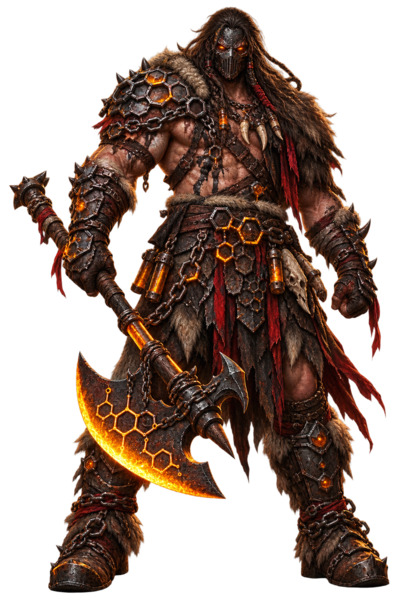
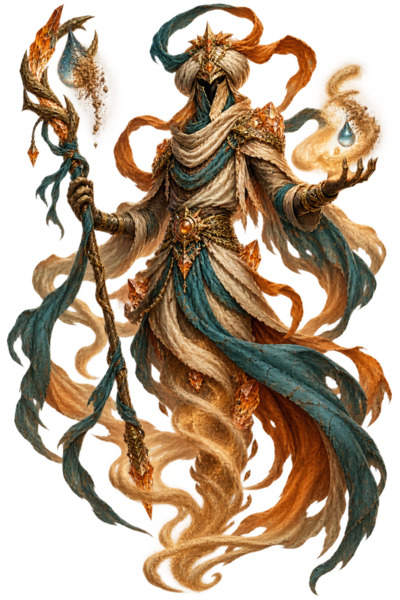
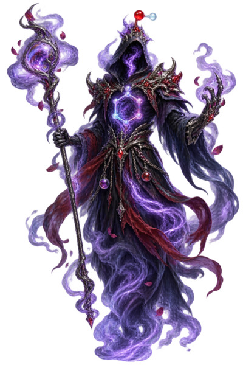
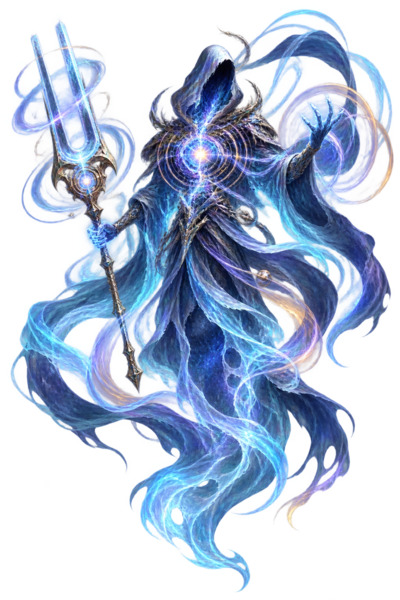
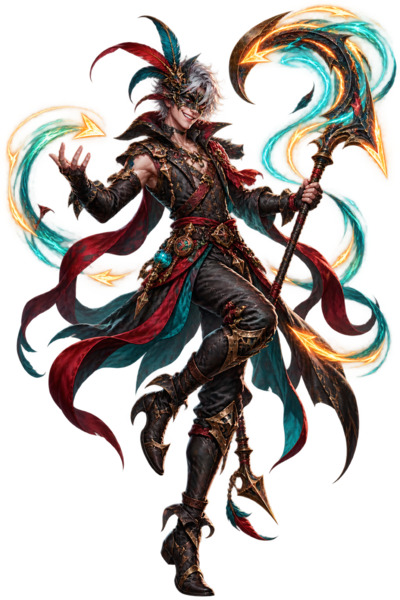
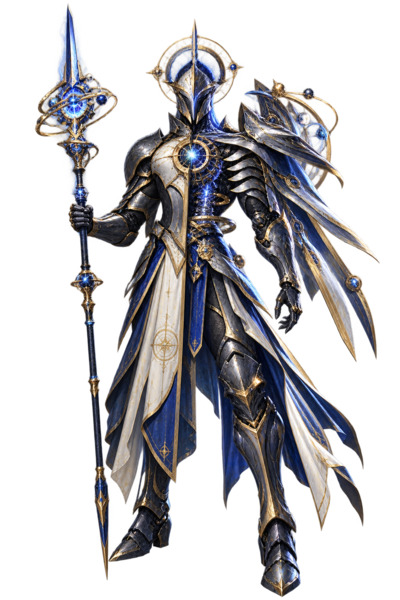
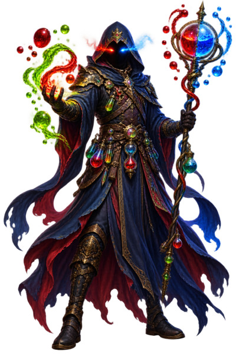
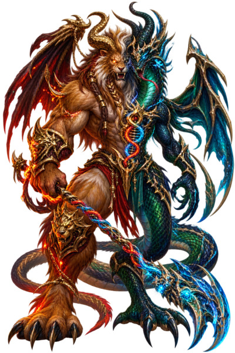
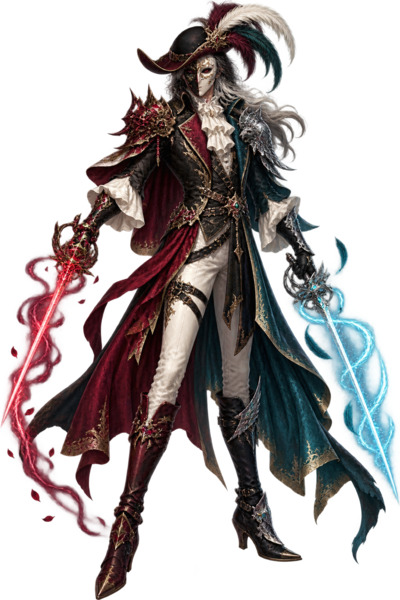
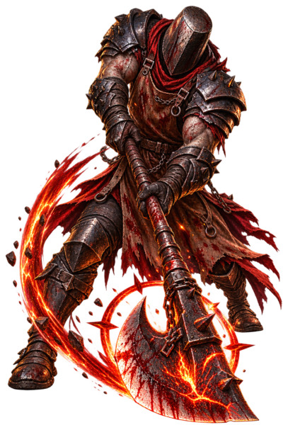

# Defeating the Boss: A Literature Synthesis Proposing a Combat-Based Framework for Teaching Organic Chemistry

*A conceptual synthesis grounding a chemistry-fantasy boss-battle instructional design in existing learning-science and game-based-learning research*

# Abstract

This paper is a literature synthesis, not an experimental study: it does not report learning-outcome data from students, but it does include a content analysis of an actual 60-character boss roster supplied for this synthesis, examined against findings from cognitive psychology, motivation research, chemistry education research, and game design literature. The roster translates chapters of an organic chemistry textbook into a bestiary of fantasy "boss" characters — an *Alcohol Alchemist*, a *Phenol Phantom*, a *Dehydration Djinn* — that a student must defeat by correctly reasoning through the chemistry concept each boss embodies. Drawing on the testing effect, spaced-practice research, structure-mapping theory of analogy, self-determination theory, and the chemistry-education literature on organic chemistry misconceptions and multi-level representation, this synthesis argues that a boss-battle mechanic is best understood not as a single new learning mechanism but as a packaging strategy that can carry conceptual weight through two distinct channels: the battle mechanic itself (effortful retrieval with feedback) and the character's visual design, when that design is built as a systematic relational model of the mechanism rather than a set of arbitrary, memorable attributes. A content analysis of a representative sample of the roster finds evidence consistent with the latter: recurring, chemically grounded visual mappings — a shifting, formless wraith for resonance delocalization, mirror-symmetric bodies for enantiomers with that symmetry deliberately broken for diastereomers, an established acid–base color convention borrowed rather than invented — appear across multiple independently designed characters rather than on a single showcase example. The paper closes by identifying the specific evidence gap this idea would still need to fill before it could be evaluated for actual learning outcomes, and by outlining what such a study would need to measure.

# 1. Introduction and purpose of this synthesis

A boss fight is, structurally, a test. The player has spent a level or a chapter acquiring tools, and the boss is the moment those tools are checked under pressure. Video game designers already describe this using language that will sound familiar to anyone who studies learning: telegraphed attacks that must be read correctly, patterns that must be recognized rather than guessed, and failure that teaches rather than punishes. A recently proposed design extends that structure to an academic subject, translating chapters of an organic chemistry textbook into a bestiary of chapter bosses such as the Alcohol Alchemist, the Phenol Phantom, and the Hydroxyl Golem, with the intent that defeating each boss requires the player to reason through the chemistry concept it represents, and that the boss's color, silhouette, and gestures are themselves designed to encode features of that concept — for example, a desert-worn Djinn depicted holding a departing water molecule as a visual model of dehydration, rather than a generic monster carrying a chemistry-themed name.

No published study has tested this exact design, and this paper does not claim to have tested it either. What follows is a literature synthesis: it draws together several bodies of research that, taken separately, already speak to pieces of the idea — retrieval practice, spaced practice, structure-mapping theory and multi-level chemical representation, self-determination theory, chemistry-specific misconception research, and the game-based-learning and gamification literatures — and asks what they collectively predict about a game built this way. It also, in Section 3, examines an actual roster of 60 boss illustrations against that theoretical framework, which is a step beyond a purely hypothetical synthesis. The purpose is to state the theoretical case for the design as precisely as the literature allows, to be explicit about where that case is strong and where it is speculative, and to identify what an empirical test of the idea would need to measure. Section 2 synthesizes the relevant theory, including a distinction between arbitrary and structurally mapped visual design that the rest of the paper depends on. Section 3 tests that distinction against an existing 60-boss roster. Section 4 reviews the empirical record on game-based learning generally, including its inconsistencies. Section 5 situates the proposed design against techniques with established evidence. Section 6 states the resulting hypotheses and the design conditions under which the literature suggests they would hold. Section 7 outlines what a future empirical study of this design would need to include.

# 2. What learning mechanism does 'defeating a boss' activate?

Defeating a boss is not one mechanism; it is a container that can hold several. The educational payoff depends on which of the following are actually present in the battle design.

## 2.1 Retrieval practice, disguised as combat

The most consistently supported study technique in the cognitive-psychology literature is practice testing: effortfully pulling information out of memory rather than re-reading it. Roediger and Karpicke's classic studies showed that students who tested themselves on material retained it far better a week later than students who simply reread it, even though the rereading group felt more confident at the time. Dunlosky and colleagues' widely cited review of ten learning techniques rated practice testing and distributed (spaced) practice as the only two techniques with high utility across ages, subjects, and conditions; techniques like summarizing, highlighting, and rereading were rated low utility precisely because they don't require retrieval.

A boss whose attacks can only be countered by correctly answering a mechanism question, predicting a product, or identifying a functional group is, underneath the artwork, a retrieval-practice engine. The battle forces the same effortful recall that a well-built practice quiz forces — the difference is that failure has an immediate, visible, in-fiction consequence (the player takes damage) rather than a grade written days later. That immediacy of feedback is itself part of what makes retrieval practice work; delayed or absent feedback blunts the testing effect.

## 2.2 Boss battles as 'desirable difficulty' and rehearsed failure

Game designers already articulate something close to Bjork's concept of desirable difficulty without using that phrase. Writing on boss design describes the best encounters as ones where a player dies and thinks "I'll dodge left next time," not "that was unfair" — failure that teaches rather than merely punishes. One design writer calls a boss fight rehearsed hardship: a compressed, safe rehearsal of a real difficulty, with unlimited retries and no permanent record of the failed attempts. That structure matters for a subject like organic chemistry, where research on student misconceptions shows that repeated failure in ordinary coursework damages self-efficacy and can push students out of the field, particularly around difficult topics like stereochemistry. A boss fight reframes the same missed answer as an expected step in mastering the pattern rather than as a mark against the student.

A related mechanic noted in analyses of classic boss design is the 'flashing weakness': an early, easy encounter reveals a vulnerability through visible feedback rather than an instruction manual, and the player is expected to look for the analogous weakness in later, harder bosses without being told to. Applied to chemistry, this is inductive pattern-recognition training — a Resonance Wraith that visibly shifts between two forms without changing its total charge is teaching the player to look for that shift as a category, not just memorizing one fact about one molecule.

## 2.3 Two different things called 'personification': arbitrary labels versus structural visualizations

An earlier version of this synthesis argued that a boss's visual design functions mainly as a memory hook for its name, with the actual chemical reasoning left to the battle mechanic. That claim was too broad, because it treats two different design choices as one. The mnemonics literature's low-utility verdict applies specifically to arbitrary pairings: a keyword mnemonic works by linking a term to an image chosen for its sound or its vividness, with no structural relationship between the image and the concept's internal logic. A generic 'scary alchemist' silhouette attached to the word 'alcohol' would be exactly that kind of arbitrary pairing, and the low-utility caveat holds for it.

A design where color, posture, and props are chosen to encode the actual mechanism is a different thing entirely, and the relevant theory for evaluating it is not the keyword-mnemonic literature but Gentner's (1983) structure-mapping theory of analogy. Structure-mapping distinguishes analogies that transfer isolated *attributes* (surface features, chosen for vividness) from analogies that transfer *relations* between elements, and argues that people find and retain relational mappings more readily than attribute mappings, particularly when the relations form a connected, *systematic* structure rather than a set of independent coincidences. A brown, desert-worn Djinn is an attribute (color chosen to evoke dryness); a Djinn depicted *holding a water molecule it has just pulled away from the substrate* is a relation — it encodes the departure of H₂O from the carbon skeleton, which is the actual step being tested. That second choice is structurally isomorphic to the mechanism, not merely reminiscent of its name.

This distinction has a direct, testable design consequence. Under Gentner's systematicity principle, an analogy earns more transfer value the more of its individual mappings connect into one coherent relational system, rather than each being a separate, unrelated flourish. A Dehydration Djinn holding a departing water molecule is one relational mapping (removal of H₂O). The design becomes substantially stronger if the same logic is carried through to the boss that fails to demonstrate the reaction: a Phenol Phantom whose battle design shows the Djinn's water-pulling attack failing to detach anything, with the aromatic ring visibly glowing or reinforcing itself as a stabilizing shield, encodes the actual reason phenols resist dehydration — the ring's aromatic stabilization outcompetes the elimination pathway, rather than phenols merely being 'a different chemical' that happens to resist for unstated reasons. That is not a mnemonic label; it is a visual model of a mechanistic relationship, and it is analogous to what chemistry education research calls representing a concept at the submicroscopic level rather than only the symbolic level.

This connects to a chemistry-specific line of research rather than the general mnemonics literature: Johnstone's (1991) framework describes chemical understanding as requiring coordination across three levels — the macroscopic (what you can observe, e.g., a reaction happening or not), the submicroscopic (the molecular-level mechanism, e.g., a leaving group departing), and the symbolic (equations and formulas). A large body of chemistry education research finds that students struggle specifically because instruction leaves these levels disconnected — a symbolic mechanism arrow with no macroscopic or submicroscopic anchor, or vice versa. A boss design where the color and material of the character encode a macroscopic property (desert-dry, brittle, water-hungry), the gesture encodes the submicroscopic event (pulling a water molecule away from a bond), and the underlying rules encode the symbolic mechanism (elimination requires a leaving group and an adjacent hydrogen) is, if built consistently, a way of holding all three Johnstone levels in a single, simultaneously visible representation — which is closer to what multimedia-learning research (Mayer, 2009) calls dual-channel processing with signaling: images and words together, with visual cues pointing at exactly the feature that matters, rather than a generic illustration competing with the text for attention.

None of this removes the earlier caution entirely, though it does relocate it. The risk is no longer that personification is inherently shallow; the risk is that a design team will believe they have built a systematic relational mapping when they have actually built a set of independent, unconnected flourishes — a striking color here, a dramatic gesture there — none of which map onto a specific chemical relation, and all of which happen to look coherent because they share a fantasy aesthetic rather than because they share a chemical logic. The design test this synthesis would propose, following Gentner's systematicity principle, is concrete: for each visual choice on a boss (color, posture, prop, environment), ask whether it maps onto a specific relation in the chemistry — a bond breaking, a group leaving, a structure stabilizing, a geometry constraining an approach — or whether it is decorative. A roster where every boss passes that test is doing real conceptual work through its visual design, in parallel with whatever the battle mechanic separately requires; a roster where only the names pass that test, and the art is otherwise generic monster design, is the weaker case this synthesis originally described.

## 2.4 Motivation: what gamification changes, and what it doesn't

Self-determination theory frames motivation around three needs — autonomy, competence, and relatedness — and a recent meta-analysis of gamification in education found that gamified elements reliably increase students' sense of autonomy and relatedness, and boost intrinsic motivation, but have a much smaller, less reliable effect on actual competence or mastery. That finding maps directly onto the risk facing any chemistry-fantasy game: engagement and enjoyment are the part gamification is good at proving out; content mastery is not guaranteed by the same mechanics and has to be engineered separately, through the battle logic itself rather than the reward layer around it.

The moment of victory over a boss is also, per game-design writing on the topic, one of the strongest sources of a felt sense of accomplishment in any game genre, and that accomplishment is what tends to make players seek out the next challenge voluntarily rather than because an assignment is due. For a subject students often approach with anxiety, converting the emotional tenor of practice from dread to anticipated challenge is a real, if motivational rather than cognitive, benefit.

## 2.5 Confronting misconceptions directly

Organic chemistry education research consistently finds that students default to memorizing surface features and reaction names rather than reasoning from structure, mechanism, and energy, and that specific misconceptions — around resonance, stereochemistry, and mechanism arrows in particular — are persistent and correlate with lower achievement and lower self-efficacy. The design recommendation in the original character-design notes, that each boss should target a specific student misconception, addresses this directly: a battle mechanic can be written so that the 'wrong' move is not merely incorrect but is the specific error the literature documents students making, so the game corrects the error at the moment it would otherwise be reinforced by guessing.

# 3. A content analysis of the existing 60-boss roster

Section 2.3 argued, in the abstract, that a boss's visual design can carry real conceptual content if its color, gesture, and props form a systematic relational mapping onto the underlying chemistry. That argument can now be checked against an actual artifact. A complete roster of 60 boss character illustrations, each named for an organic chemistry concept and spanning topics from hydrocarbon structure through synthesis strategy, was made available for this synthesis. What follows is a content analysis of a representative sample of that roster (14 of the 60 images, roughly one in four, hand-selected to cover every major chemistry category rather than only the most visually striking examples) against the structure-mapping and multi-level-representation framework from Section 2.3. This is a qualitative coding exercise by a single reviewer, not a validated content analysis with inter-rater reliability — that limitation is discussed in Section 3.9 — but it is the first evidence in this synthesis that goes beyond a hypothetical example.

Table 2 shows how the full 60-boss roster distributes across the major topics of an organic chemistry course, confirming that the roster follows the chapter-by-chapter structure described in the original design notes rather than clustering around a few favorite topics.

| Category (chemistry topic) | Bosses in this category (of 60 total) |
| --- | --- |
| Hydrocarbon backbones & structure (9) | Alkane Marauder, Alkene Charger, Alkyne Overlord, Cycloalkane Crusher, Triple-Bond Basilisk, Ring-Strain Behemoth, Skeletal Sketcher, Molecular Mapmaster, Hybridization Goblin |
| Functional groups & properties (6) | Alcohol Alchemist, Hydroxyl Golem, Phenol Phantom, Functional-Group Golem, Polarity Phantom, Molecular-Property Titan |
| Addition, elimination & substitution reactions (14) | Dehydration Djinn, Addition-Reaction Titan, E1 Sorcerer, E2 Executioner, SN1 Knight, SN2 Assassin, Markovnikov Marauder, Hydration Harpy, Hydroboration Ranger, Halogenation Hunter, Halohydrin Hydra, Oxidation Ogre, Reduction Reaver, Bondbreaker Brute |
| Reactive intermediates & electronic structure (10) | Carbocation Shapeshifter, Radical Reaper, Nucleophile Raider, Electrophile Warden, Resonance Wraith, Orbital Ogre, Conjugate Basilisk, pKa Warlock, Proton Prowler, Lewis Rune Knight |
| Stereochemistry & conformational analysis (8) | Chiral Chimera, Enantiomer Elf, Diastereomer Duelist, Stereochemistry Overlord, Conformer Imp, Conformation Seer, Conformation Mimic, Newman Sentinel |
| Mechanism representation & kinetics (8) | Curved Arrow Trickster, Mechanism Titan, Transition-State Wraith, Equilibrium Lich, Initiation Imp, Propagation Phantom, Chain-Reaction Colossus, Transformation Tactician |
| Synthesis & strategy — capstone bosses (5) | Synthesis Grandmaster, Synthetic Pathweaver, Retrosynthesis Rogue, Reagent Alchemist, Acetylide Archer |

Table 2. The 60-boss roster organized by chemistry topic.

## 3.1 Hydrocarbon backbones: repeating visual units for repeating structural units

*Figure 1. Alkane Marauder.*

The Alkane Marauder is built around a repeating hexagonal chain-link motif that runs across the shoulder armor, belt, and axe blade. Alkanes are, structurally, chains of repeating –CH₂– units joined by single bonds; a repeating modular pattern across the whole costume — rather than a single hexagon used once as a logo — is a relational mapping onto that repeat-unit structure, not just an attribute chosen for a 'tough barbarian' look. The character-class choice (a blunt, straightforward melee brute rather than a spellcaster) is also consistent with alkanes' chemical character as the least reactive, most 'basic' class of organic compound in the course sequence — the visual grammar of raw physical force is doing double duty as a difficulty-tier signal and a reactivity signal.

## 3.2 Functional groups: macroscopic property, submicroscopic event, and symbolic notation held together

*Figure 2. Dehydration Djinn.*

The Dehydration Djinn illustrates the three-level integration described theoretically in Section 2.3. The color palette (sand, brown, cracked-desert texture shot through with threads of teal) encodes the macroscopic property at stake — dryness competing with water — rather than being chosen for generic menace. The raised hand shows a water droplet actively disintegrating into sand and vapor, which is a direct depiction of the submicroscopic event the reaction accomplishes: a water molecule leaving the substrate. Nothing in the image needs a caption to communicate 'this figure is about the loss of water' — the mapping is legible without the name.

*Figure 3. Phenol Phantom.*

The Phenol Phantom takes a different, and telling, design approach: rather than showing a failed water-loss gesture, it displays the chemical structure directly. A glowing hexagonal ring sits on the character's chest — a stylized benzene ring — and a small ball-and-stick model of two bonded atoms (colored to suggest oxygen and hydrogen) floats above the hood, identifying the hydroxyl group. This is a symbolic-level representation (Johnstone's third level) embedded directly into the character rather than translated into an action or gesture. Whether the underlying game rules literally pit this boss's aromatic stability against the Djinn's water-pulling attack is a mechanic-design decision that cannot be verified from artwork alone, but the two character designs are visually compatible with exactly that interaction: one boss whose gesture is water leaving, and one boss whose defining visual feature is the stabilizing ring structure that would resist that same gesture. If the battle mechanics make that resistance explicit, the pair would be a strong instance of the H4 mapping described earlier; if the connection is left implicit, the images alone are still each independently informative, but the systematic pairing across bosses — the feature this synthesis argues matters most — would depend on the mechanic design carrying it the rest of the way.

## 3.3 Reactive intermediates: instability rendered as visual instability

*Figure 4. Carbocation Shapeshifter.*

The Carbocation Shapeshifter's silhouette is asymmetric, jagged, and threaded with erratic red-and-blue energy that looks structurally unlike the more composed, symmetric armor design used elsewhere in the roster. A carbocation is an electron-deficient, high-energy species that is inherently unstable and prone to rearrangement (hydride and methyl shifts) into a more stable form — which is also what the name 'shapeshifter' names directly. Here the relational mapping runs through three channels at once: the name (rearrangement), the silhouette (asymmetric, unstable), and the color treatment (crackling, discontinuous energy rather than a smooth glow). That is a stronger, more redundant mapping than a single visual channel alone would provide, which by the dual-coding and multimedia-learning literature (Paivio, 1986; Mayer, 2009) should make the underlying instability easier to remember and to recognize on a new molecule.

## 3.4 Resonance: a form with no fixed shape

*Figure 5. Resonance Wraith.*

This is, on the evidence reviewed here, the single most disciplined mapping in the sample. A resonance structure is not a real, isolable molecule; it is one of several ways of drawing electron placement for a structure whose true electron distribution is a blend of all of them. The Resonance Wraith is drawn with no fixed solid body at all — a translucent, constantly billowing form with concentric pulsing rings of light at the chest where a torso would otherwise be. The category of monster chosen (a wraith, defined across fantasy fiction as an insubstantial, shifting presence rather than a solid body) is itself the analogy: the character cannot be pinned to one fixed shape any more than a resonance hybrid can be pinned to one fixed structure. This is a case where the choice of monster archetype, not just its color or props, is doing the relational work.

## 3.5 Symbolic-level notation embedded directly into character design

*Figure 6. Curved Arrow Trickster.*

Curved arrow notation — the small hooked arrows organic chemists draw to show where electron pairs move during a mechanism step — is a symbolic-level convention with no obvious 'natural' visual form outside chemistry itself. The Curved Arrow Trickster's signature visual effect is a set of glowing, hooked, curling arrow-trails swirling from the character's hands and staff, in the same curved-hook shape used in a mechanism diagram. This is close to a direct transcription of the symbolic-level representation into the character's visual identity, rather than a metaphor for it, and it is the clearest case in the sample of Johnstone's symbolic level being rendered with no translation step required.

*Figure 7. Newman Sentinel.*

The Newman Sentinel does something similar for a different symbolic convention. A Newman projection is drawn as a front atom (a dot, with three bonds radiating at 120°) in front of a back atom (a circle, with its own three bonds, staggered or eclipsed relative to the front dot) — the standard diagram used to reason about conformational analysis. The medallion at the character's chest and the ornament atop the character's staff are both built from concentric rings with radiating spokes, closely echoing that projection diagram's front-dot-behind-circle geometry. As with the Curved Arrow Trickster, the mapping here again sits at the symbolic level rather than the macroscopic or submicroscopic level — a reminder that a systematic design would need to cover all three Johnstone levels across the roster as a whole, not just one level repeatedly.

## 3.6 An established chemistry convention borrowed directly: acid–base color coding

*Figure 8. pKa Warlock.*

The pKa Warlock's design splits down a red–blue axis: one glowing eye and a row of belt vials in red, the other eye and a row of vials in blue, and a two-toned orb split cleanly down the middle atop the staff. Red-for-acid and blue-for-base is not an invented color convention for this game — it is the litmus-paper color convention already used throughout chemistry instruction. Borrowing an existing disciplinary convention rather than inventing an arbitrary color scheme is, if anything, a stronger design choice than an original mapping would be, because the learner does not have to learn a new color code invented only for this game; the mapping is already reinforced by every other acid–base representation the student will encounter.

## 3.7 Stereochemistry: mirror symmetry for enantiomers, broken symmetry for diastereomers

|     Figure 9. Chiral Chimera. |     Figure 10. Enantiomer Elf. |     Figure 11. Diastereomer Duelist. |
| --- | --- | --- |

This is the strongest evidence in the sample that the visual grammar is systematic across the roster rather than a one-off flourish on a single showcase character, because the same design rule appears twice with a deliberate variation. Enantiomers are non-superimposable mirror images of each other — identical in every connectivity but related by reflection. Both the Chiral Chimera (a creature literally bisected down its vertical axis into a warm lion-half and a cool serpent/dragon-half, gripping a twisted double-helix chain between its two mirrored hands) and the Enantiomer Elf (a figure with a strict left–right color and weapon split, mismatched red/blue eyes, and mirror-curling energy trails on each leg) use the same strict bilateral mirror-symmetry rule to represent 'identical parts, opposite handedness.'

Diastereomers are stereoisomers too, but they are not mirror images of each other — they share some spatial relationships and differ in others. The Diastereomer Duelist breaks the strict mirror rule that governs the other two stereochemistry bosses: the left and right sides use a related but non-identical color scheme (maroon and teal rather than a true complementary mirror pair), and — critically — the two swords are different weapons with different effects (a curling flame-trailed rapier versus a straight electric-trailed saber) rather than a single weapon mirrored left-to-right. A design team that did not understand the underlying chemical distinction could easily have given the Diastereomer Duelist the same strict mirror treatment as the enantiomer-themed bosses; the fact that it instead uses a related-but-broken symmetry is evidence that the visual grammar is tracking the actual chemical relationship (mirror-image versus non-mirror-image stereoisomers) rather than reusing one 'twin' template for every boss with 'stereo' in its concept.

## 3.8 Mechanism as choreography: attack pattern as a relational channel distinct from body design

|     Figure 12. SN2 Assassin. |     Figure 13. E2 Executioner. |
| --- | --- |

Not every boss in the sample encodes chemistry through static body design; some encode it through the pose or implied motion instead, which is a distinct channel from the ones discussed above and worth naming separately for future design and measurement purposes. The SN2 Assassin is captured mid-strike, driving a blade through and out the back of a shattering shield-like structure — a pose consistent with a nucleophile attacking from the side directly opposite the leaving group, the 'backside attack' that gives the SN2 mechanism its inversion of configuration. The E2 Executioner swings a single heavy axe through one wide, continuous arc rather than a flurry of separate strikes, which is at least suggestive of a concerted, one-step elimination (as opposed to the two-step E1 mechanism) requiring a specific anti-periplanar geometry. These readings are more interpretive than the Djinn's water-droplet gesture or the stereochemistry trio's mirror symmetry, and this synthesis flags them as the weaker end of the evidence rather than claiming certainty about design intent.

## 3.9 Summary and limitations of this content analysis

Across the fourteen images reviewed, spanning all seven topic categories in Table 2, a majority showed at least one relational (not merely attribute-level) mapping onto the chemistry concept, and several — the Resonance Wraith, the stereochemistry trio, and the Dehydration Djinn's gesture — showed mappings specific enough that a reader could infer the underlying chemistry from the image with the name covered. This is evidence that the design as actually built leans toward the H4-consistent case described in Section 2.3, not the arbitrary-personification case the original mnemonics caution was written to guard against.

Three limitations apply to this claim. First, the sample is 14 of 60 images (about 23%), selected by the reviewer to cover every topic category rather than drawn at random, and a reviewer choosing examples to make a point is a source of selection bias this synthesis cannot rule out on its own evidence; a full audit of the remaining 46 images, ideally by raters blind to this synthesis's argument, would be needed before treating this as a settled description of the roster. Second, this is an analysis of static artwork only; it says nothing about whether the battle mechanics that accompany each boss actually test the concept the artwork depicts, which remains the separate question addressed by H1 and H3 and Section 7's manipulation-check requirement. Third, and most importantly, none of this establishes that students notice or use these visual mappings during play rather than treating the art as decoration to click past — that is an empirical question about learner behavior, not a property of the artifact, and it is exactly what H4 in Section 6 below is designed to test.

# 4. What the broader game-based learning evidence shows

Independent of this specific design, meta-analytic evidence on game-based learning is generally positive but not unconditional. A meta-analysis of 41 studies covering game-based science learning found an overall positive effect on achievement, but noted the effect was stronger for shorter interventions (between four hours and a week) than for very brief or very long ones, and stronger for younger students than for undergraduates — a caution against assuming a college-level chemistry game will show gains as large as those seen in K-12 studies. A separate meta-analysis restricted to digital STEM games found a more moderate overall effect, and explicitly noted that individual studies have found null or even negative effects on math achievement when games substitute for, rather than add retrieval and feedback to, standard review.

The consistent thread across these reviews is that game-based learning helps when the game requires the same cognitive work that direct instruction would require — recall, prediction, application — and helps far less when the 'learning' is decorative around a game that is really just entertainment with facts attached. This is the same caution raised in the original design notes: the approach only works if chemistry actually affects gameplay, not just naming and artwork.

# 5. Comparing the boss-battle format to established study techniques

The table below places the proposed boss-battle design alongside the study techniques a college student is already likely to use or be told to use, drawing on Dunlosky et al.'s (2013) utility ratings and the game-based learning and gamification research above.

| Technique | Core mechanism | Evidence strength | Where it's strong | Where it's limited |
| --- | --- | --- | --- | --- |
| Rereading / highlighting | Passive re-exposure to text | Low utility (Dunlosky et al., 2013) | Cheap, familiar, low effort to start | Creates illusion of fluency without durable retention; weakest evidence of the common techniques |
| Keyword mnemonics (arbitrary label–image pairing) | Link a term to a vivid but structurally unrelated image or sound-alike cue | Low-to-moderate; works for concrete vocabulary, not schemas | Fast recall of a label (e.g., a boss's name) | Doesn't build the relational reasoning needed to apply a concept to a new molecule; distinct from systematic visual modeling (see Section 2.3) |
| Practice testing / retrieval practice | Effortful recall of information from memory, with feedback | High utility; large, replicated effects across ages and content | Durable, transferable retention; exposes what's not yet known | Students underuse it voluntarily; needs to be built into the material |
| Spaced / distributed practice (Anki-style flashcards) | Same material revisited at increasing intervals | High utility; 50–200% better retention than cramming (Cepeda et al., 2006) | Long-term retention with modest daily time cost | Card review is often shallow (recognition) unless cards demand real recall |
| Self-explanation / elaborative interrogation | Learner articulates why something is true or how it connects to prior knowledge | Moderate utility; promising but less tested outside the lab | Builds conceptual, not just factual, understanding | Effortful to prompt well; students often give shallow explanations without guidance |
| General gamification (points, badges, leaderboards) | Extrinsic reward layered on top of ordinary tasks | Reliably lifts motivation and engagement; weak/inconsistent effect on actual mastery | Sustains attendance and time-on-task | Motivation gains often outrun learning gains if content isn't embedded in the mechanic |
| Chemistry-fantasy boss battles (this design) | Defeating an opponent requires correctly retrieving, predicting, or applying the concept it embodies | No direct studies of this exact design; built from techniques individually rated high/moderate utility | Combines retrieval, spacing, dual-coding, and motivation in one loop, if built correctly | Success is not automatic — depends entirely on whether the battle mechanic forces real chemical reasoning |

Read as a whole, the table suggests the boss-battle format's real contribution is not a new cognitive mechanism but a way of packaging several already-validated mechanisms — retrieval, spacing, dual coding, targeted misconception correction, and motivational scaffolding — into a single activity a student will voluntarily repeat. Flashcard apps like Anki already prove that spaced retrieval works when students actually do it; their well-documented adoption problem is that self-testing feels effortful and unrewarding enough that most students avoid it in favor of rereading. A boss fight is, in effect, a proposed solution to that adoption problem: making the retrieval attempt feel like play rather than like a quiz. This is a synthesis-level inference, not a demonstrated result — it is the hypothesis this literature supports, not a finding this literature has already confirmed.

# 6. Resulting hypotheses and their boundary conditions

Combining the sections above, the literature supports four specific, falsifiable hypotheses about a chemistry-fantasy boss-battle design, each with a stated boundary condition under which it should hold or fail.

1. H1 — Retention hypothesis: Students who must correctly answer a mechanism, product-prediction, or classification question to defeat a boss will retain that concept longer than students who review the same content through rereading or passive exposure, because the battle instantiates effortful retrieval with immediate feedback (Roediger & Karpicke, 2006; Dunlosky et al., 2013). This should hold only if losing the battle requires a genuine wrong answer, not a reflex or timing failure — a boss beatable by trial-and-error clicking would not produce this effect.

1. H2 — Motivation hypothesis: Students will report higher intrinsic motivation, autonomy, and course enjoyment in the gamified condition than in an ungamified control, but this gain will not, by itself, translate into a proportional gain in measured content mastery (Li, Hew, & Du, 2024). Motivation and mastery should therefore be measured as separate outcomes, not assumed to move together.

1. H3 — Misconception-correction hypothesis: Bosses whose 'losing move' is written to mirror a specific, previously documented student misconception (e.g., treating resonance structures as interconverting real species, or misapplying anti-periplanar geometry) will produce larger gains on misconception-targeted assessment items than generic content-review games, because the mechanic directly confronts the error rather than only reviewing the correct answer (Cruz-Ramírez de Arellano & Towns, 2014). This should hold only where misconceptions are explicitly identified and built into the mechanic during design — a boss designed purely around a chemistry pun would not be expected to show this effect.

1. H4 — Structural-visualization hypothesis: Bosses whose color, gesture, and props form a systematic, relational mapping onto the mechanism (e.g., a Djinn visibly pulling a departing water molecule from the substrate, or failing to do so against a visibly reinforced aromatic ring) will produce better conceptual transfer to novel molecules than bosses whose visual design consists of independent, vivid-but-arbitrary attributes (e.g., a scary face and a dramatic color chosen only for memorability). This follows from Gentner's (1983) structure-mapping theory, under which relational, systematic mappings transfer better than attribute-level ones, and should hold only where the visual mapping is consistent across the whole boss roster rather than present for one or two showcase bosses.

Each hypothesis is falsifiable and each specifies the design condition it depends on. That is the intended contribution of this synthesis: not a claim that the design works, but a precise statement of what would have to be true of the design for the literature's existing findings to predict that it works.

# 7. What an empirical test of this design would need to measure

Because this is a synthesis rather than a study, this section states what a future evaluation would require rather than claiming any of it has been done.

1. A manipulation check on the battle mechanic itself. Before any outcome is measured, a study would need to verify that the boss cannot be defeated without correctly performing the target chemical reasoning — otherwise a null or positive result cannot be attributed to the mechanism this synthesis proposes.

1. A content-mastery measure separate from an engagement measure. Given the gamification literature's finding that motivation gains and competence gains diverge (Li et al., 2024), a study would need pre/post concept assessments (e.g., validated organic chemistry concept inventory items) as well as a validated engagement or motivation scale such as the User Engagement Scale, reported as distinct outcomes rather than combined into one "success" metric.

1. A comparison condition matched on content and time, not just structure. To isolate the boss-battle mechanic from generic gamification (points, badges, leaderboards), the strongest design would compare it against an active-control condition that gets the same practice questions without the fantasy framing, rather than only against a lecture-only control.

1. Misconception-specific items keyed to each boss. Because H3 above depends on the wrong answer mirroring a documented misconception, assessment items would need to be written to detect that specific error, not just overall accuracy on the topic.

1. A delayed retention test, not only an immediate post-test. Since spaced and retrieval-based effects are most distinguishable from other techniques' effects after a delay of days to weeks (Roediger & Karpicke, 2006; Cepeda et al., 2006), an immediate post-test alone would understate or overstate the design's advantage.

1. Reporting of implementation fidelity across chapters. Because the theoretical case here depends entirely on each individual boss meeting the design bar (chemically meaningful failure, targeted misconception, adequate spacing), a study spanning multiple chapters would need to report whether that bar was met consistently, since a design that works for some bosses and not others is a different empirical claim than one that works or fails as a whole.

1. A visual-mapping audit, independent of the battle-mechanic audit. Because H4 depends on color, gesture, and props carrying real relational content rather than decoration, a study would need an independent coding pass — ideally by raters blind to the study's hypotheses — that scores each boss's visual elements as either mapping onto a specific chemical relation or not, so that the retrieval effect (H1) and the visualization effect (H4) can be disentangled rather than conflated into one 'game quality' impression.

# 8. Conclusion

This synthesis argues that a chemistry-fantasy boss-battle framework has a credible theoretical basis operating through two distinct channels. The battle mechanic can instantiate retrieval practice, spaced practice, and targeted misconception correction — each independently well supported. Separately, and this is a point the earlier draft of this synthesis understated, the character's visual design can itself carry conceptual weight, provided its color, gesture, and props form a systematic relational mapping onto the mechanism (per structure-mapping theory) rather than a set of vivid but arbitrary attributes (the case the keyword-mnemonic literature correctly rates as low utility). A Djinn that visibly pulls a departing water molecule from the substrate, and fails to do so against a visibly reinforced aromatic ring, is doing real conceptual work through the image alone. What the existing literature does not do — and what no existing study of this specific design has done — is confirm that either channel, or their combination, produces the predicted gains in an actual classroom, or that a fantasy skin is sufficient to make students engage with the underlying reasoning rather than pattern-match the surface features. The contribution of this paper is therefore a set of falsifiable hypotheses across both channels and a stated evidentiary bar (Sections 6 and 7), informed by the content analysis in Section 3, not a claim of proven efficacy. The idea is next in line for the same kind of implementation-and-assessment study that chemistry education researchers have already run on other gamified organic chemistry interventions — a natural next step for a design that, on the evidence synthesized here, is worth testing rather than worth assuming.

# References

Cepeda, N. J., Pashler, H., Vul, E., Wixted, J. T., & Rohrer, D. (2006). Distributed practice in verbal recall tasks: A review and quantitative synthesis. Psychological Bulletin, 132(3), 354–380.

Cruz-Ramírez de Arellano, D., & Towns, M. H. (2014). Students' understanding of alkyl halide reactions in undergraduate organic chemistry. Chemistry Education Research and Practice, 15(4), 501–515.

Dunlosky, J., Rawson, K. A., Marsh, E. J., Nathan, M. J., & Willingham, D. T. (2013). Improving students' learning with effective learning techniques: Promising directions from cognitive and educational psychology. Psychological Science in the Public Interest, 14(1), 4–58.

Gentner, D. (1983). Structure-mapping: A theoretical framework for analogy. Cognitive Science, 7(2), 155–170.

Johnstone, A. H. (1991). Why is science difficult to learn? Things are seldom what they seem. Journal of Computer Assisted Learning, 7(2), 75–83.

Kornell, N., & Bjork, R. A. (2007). The promise and perils of self-regulated study. Psychonomic Bulletin & Review, 14(2), 219–224.

Lei, H., Chiu, M. M., Wang, D., Wang, C., & Xie, T. (2022). Effects of game-based learning on students' achievement in science: A meta-analysis. Journal of Educational Computing Research, 60(6), 1373–1398. https://doi.org/10.1177/07356331211064543

Li, L., Hew, K. F., & Du, J. (2024). Gamification enhances student intrinsic motivation, perceptions of autonomy and relatedness, but minimal impact on competency: A meta-analysis and systematic review. Educational Technology Research and Development, 72(2), 765–796. https://doi.org/10.1007/s11423-023-10337-7

Mayer, R. E. (2009). Multimedia Learning (2nd ed.). Cambridge University Press.

Paivio, A. (1986). Mental Representations: A Dual Coding Approach. Oxford University Press.

Roediger, H. L., & Karpicke, J. D. (2006). Test-enhanced learning: Taking memory tests improves long-term retention. Psychological Science, 17(3), 249–255.

Ryan, R. M., & Deci, E. L. (2000). Self-determination theory and the facilitation of intrinsic motivation, social development, and well-being. American Psychologist, 55(1), 68–78.

Wang, L.-H., Chen, B., Hwang, G.-J., Guan, J.-Q., & Wang, Y.-Q. (2022). Effects of digital game-based STEM education on students' learning achievement: A meta-analysis. International Journal of STEM Education, 9(1), Article 26. https://doi.org/10.1186/s40594-022-00344-0

Chou, Y. (2023). Boss fight design: 5 keys to bosses players never forget. Octalysis Group. https://yukaichou.com/advanced-gamification/game-design-technique-14-mastering-the-boss-fight/

University XP. (2020). Game mechanics for learning. https://www.universityxp.com/blog/2020/12/3/game-mechanics-for-learning

Note on chemistry-education context: the misconception patterns and gamified-organic-chemistry course examples referenced in this synthesis are consistent with the broader body of gamification work published in the Journal of Chemical Education (e.g., studies gamifying introductory organic chemistry courses and organic chemistry laboratory courses, 2021–2026) and with the Chemistry Education Research and Practice literature on organic chemistry misconceptions; readers designing an empirical follow-up should consult that literature directly for instrument design.
